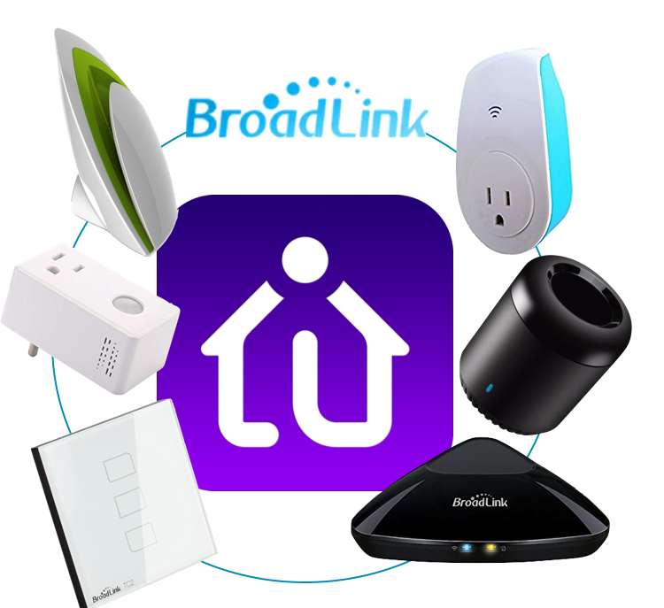

# Indigo Plugin: Broadlink Devices

This plugin allows you to control the Broadlink IR blaster products with [Indigo](https://www.indigodomo.com/).
Hit me up if you need help adding support for newer/different devices. I
currently only own a RM Pro+ because [oceanplexian](https://github.com/oceanplexian)
purchased it for me and asked me to make a plugin. Support for the RM3 Mini was added
by [Colorado Four Wheeler](https://github.com/colorado4wheeler).

## Tested Devices

- [RM Pro+](https://www.amazon.com/Broadlink-RM33-RM-Pro-Automation/dp/B078W1JVYK)
- [RM3 Mini3](https://www.amazon.com/Broadlink-RM33-RM-Pro-Automation/dp/B078BCMZH6)
- [SP3 Smart Plug](https://www.amazon.com/BroadLink-Required-Control-Occupies-Assistant/dp/B01FDGO948)

Other IR and SP devices may work. Let me know!

## Future Devices

**This plugin does not expose any of the RF capabilities of the RM devices.** *If you
would like these features, help me figure it out. I don't have any RF equipment.*

*This plugin does not expose the energy reading capabilities of the SP3S. I hope
to have an SP3S soon to test with.*

Other Broadlink devices I'd like to include in future revisions:

- [A1 Environment Sensors](http://www.ibroadlink.com/a1/)

Let me know if you'd like others!

## Usage

1. [Download the latest release](https://github.com/davidnewhall/indigo-broadlink/archive/latest.zip) or clone this repo.
1. Double-click the included plugin file.
1. Install and Enable the Plugin.
1. Add a New Device, Select `Broadlink Devices`, then `RM Universal Remote` or `Smart Plug`.
1. Click `Discover`. If it fails, enter the `IP` and `Model` for the device manually.
    - Check Indigo server logs after discovery for discovery details.

#### RM Universal Remote

1. Click `Learn Command`. Point your remote and press a button.
1. Give it a name and Click `Add Command`. << *Important*
1. Click `Save`.
1. Use the Commands in Action Groups, Triggers or Schedules.

#### Smart Plugs

These devices have no special states. Select an update interval in the plugin
configuration; this ensures local state changes are reported as expected.
Control these devices with On/Off commands as you would any other relay device.

## Licenses

#### This Plugin

- [GPLv2](https://www.gnu.org/licenses/gpl-2.0.txt): See [LICENSE](LICENSE) File

#### Dependencies

- [broadlink library](https://github.com/mjg59/python-broadlink): [MIT](https://github.com/mjg59/python-broadlink/blob/master/LICENSE)
- [pyaes](https://github.com/ricmoo/pyaes/): [MIT](https://github.com/ricmoo/pyaes/blob/master/LICENSE.txt)
- [PyCRC](https://github.com/alexbutirskiy/PyCRC): [GPLv3](https://github.com/alexbutirskiy/PyCRC/blob/master/LICENSE)
